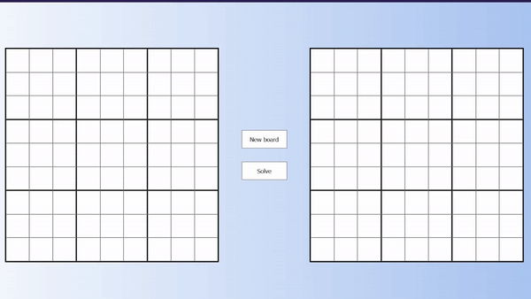

# 💭 Main ideas involved

A web app that takes sudokus and solves them.

# 📜 Description of the project

## Where does the project come from ...

Looking at free API's, I found out about one giving sudoku boards. I thought it would be algorithmically interesting and visually fun to make a sudoku solver (and it was !).

## What the project does ...

The web app allows you to generate a sudoku board (taken from the API). For each new board you are presented with the solved version (the right grid) and the solvable one (on the left). By clicking the "solve" button you can then ask the website to solve the puzzle.

The application uses the recursive algorithm of backtracking. The solving has been slowed to allow the user to better see the process occurring.

# 💾 Technologies used

- Typescript

- React

- Dosuku API (https://sudoku-api.vercel.app/)